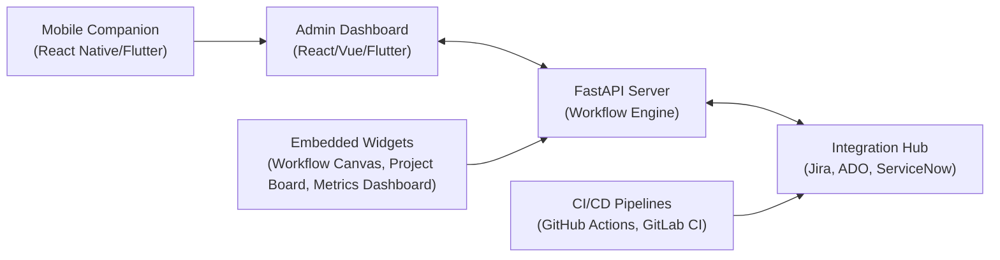

# Enterprise PM Agent

An enterprise-grade, AI-enhanced Project & Delivery Management agent that adapts to any methodology (Waterfall, Scrum, SAFe, LeSS, Hybrid, etc.) and integrates seamlessly with the tools your organization already uses. Built on a FastAPI backend, it exposes a clean REST API (Vercel-ready) and is accompanied by a customizable Admin-Dashboard, embeddable widgets, and a mobile companion app.

---

## 1. Overview

### What it is?

enterprise-pm-agent is a backend service that orchestrates project workflows, executes AI-driven insights, and connects to external PM-systems via pluggable adapters. The core is written in Python/FastAPI and can be deployed to Vercel, Kubernetes, or any Docker-capable environment.

### Problems it solves?

| Problem | How the agent solves it |
|---|---|
| Inconsistent processes across teams | Centralized workflow engine with versioned, methodology-specific templates |
| Manual status reporting | Auto-generated executive summaries, burn-up/down charts, and risk alerts |
| Tool-siloed data | Bidirectional adapters for Jira, Azure DevOps, ServiceNow, SAP, Git, etc. |
| Lack of governance | Role-based access, audit logging, immutable history, and policy enforcement |
| Slow decision making | Natural-language project-plan generation, AI-suggested mitigations, and predictive analytics |

### Who it is for?

- PMO & Delivery Leaders who need standardized reporting and compliance evidence
- Engineering & Product Teams that want lightweight, self-service workflow execution
- Enterprise Architects seeking a pluggable, secure backbone for PM tooling
- Operations & SRE teams that require health-checking, monitoring, and alerting

## High-Level Architecture



- Workflow Engine – State-machine based, pluggable, version-controlled workflow definitions (Waterfall, Scrum, SAFe, …).
- Integration Hub – Adapter pattern; each external system (Jira, Azure DevOps, ServiceNow, …) implements a common interface (BaseIntegrationAdapter).
- Admin Dashboard – React-based SPA that visualizes workflow state machines, monitors live instances, shows integration health, and provides a configuration editor.
- Embeddable Widgets – Stand-alone micro-frontends that can be dropped into existing portals (Confluence, SharePoint, custom intranet).
- Mobile Companion – React Native/Flutter app for approvals, push notifications, and offline sync.
- AI Service Layer – Calls the Vercel AI Gateway (or any LLM provider) for plan generation, risk analysis, and natural-language querying.
- Storage Layer – Abstract storage adapter (in-memory, file, PostgreSQL, MongoDB) with lazy-initialized connection pools.
- Security – JWT-based authentication, optional IdP integration (Azure AD, Okta, LDAP), role-based access, audit logging, rate limiting, circuit-breaker patterns.

---

### Custom Admin-Dashboard

The Admin Dashboard is a separate SPA (React + TypeScript + Ant Design) that consumes the agent’s REST API. It solves the need for a single pane of glass where administrators can:

1. Visualize any workflow as an interactive state-machine diagram.
2. Monitor active workflow instances in real time (filters by entity, user, date range).
3. Check health of all configured integrations with one-click test buttons.
4. View metrics & analytics (throughput, average cycle time, SLA breaches).
5. Manage users & roles when authentication is enabled (assign roles, reset passwords).
6. Edit configuration (environment variables, feature flags, workflow definitions) without touching code.

The dashboard is optional; the core agent functions perfectly via API alone, and the same capabilities are exposed through the embeddable widgets and mobile companion.

---

## 2. Key Features

| Feature | Description |
|---|---|
| Workflow Automation | Define, version, and execute any PM methodology as a state-machine; transitions can trigger notifications, external API calls, or custom scripts. |
| AI-Driven Project Insights | Natural-language project-plan generation, risk-identification, executive-summary creation, and suggestion engine (via Vercel AI Gateway or any LLM). |
| Extensible Integration Framework | Plug-and-play adapters for Jira, Azure DevOps, ServiceNow, SAP, GitHub, GitLab, Bitbucket, and custom REST/SOAP services. |
| Customizable Workflows | JSON/YAML workflow definitions allow you to add states, transitions, guards, and actions without code changes. |
| Enterprise Security | JWT authentication, optional IdP federation, RBAC, audit logging, input validation, output encryption, rate limiting, and circuit-breaker protection for external calls. |
| Observability & Monitoring | Structured logging, Prometheus-compatible metrics, health-check endpoints, distributed tracing, and alert-ready dashboards. |
| Vertical Scalability | Stateless FastAPI workers, connection pooling, Redis-backed caching, and horizontal pod autoscaling (Kubernetes) or Vercel auto-scaling. |
| Governance & Compliance | Immutable workflow history, tamper-evident logs, data-retention policies, and export-ready reports (PDF, CSV, Excel). |

### 2.1 Custom Admin-Dashboard

The Admin Dashboard is a separate repository (enterprise-pm-agent-admin) that you can clone, configure, and deploy wherever you host internal web apps (Netlify, Vercel, Azure Static Web Apps, or an internal IIS/NGINX server).

#### 2.1.1 Features

| Feature | What it does |
|---|---|
| Workflow Visualization (State Machines) | Drag-and-drop editor to view or modify workflow definitions; each state and transition is clickable for details. |
| Real-time Instance Monitoring | Live list of active workflow instances with filters (entity, assignee, state, dates). Clicking an instance shows its full history and context. |
| Integration Health Checks | One-click “Test Connection” per adapter; status indicators (healthy / degraded / unhealthy) with last-tested timestamp. |
| Metrics & Analytics | Pre-built charts: throughput (instances/hour), average lead-time, SLA compliance, distribution by workflow type. Export to CSV/PDF. |
| User Management (if Auth enabled) | List, create, disable, and reset passwords for local users; view assigned roles and permissions. |
| Configuration Editor | Edit .env-style variables, feature flags, and workflow definitions via a form-based UI; changes persist to Vercel KV/Redis or a config service. |

#### 2.1.2 Embeddable Widgets

| Widget | Use-case |
|---|---|
| Workflow Canvas | Drag-and-drop designer to create or edit workflow definitions; can be embedded in a Confluence page or internal wiki. |
| Project Board | Kanban/scrum board view filtered by workflow, assignee, or sprint; supports drag-to-transition. |
| Metrics Dashboard | Ready-made charts (lead time, throughput, WIP) that refresh via WebSocket or polling; ideal for executive wallboards. |
| Integration Monitor | Grid view showing health, latency, and error rate for each connected PM tool; click to drill down to logs. |

All widgets are delivered as ESM bundles (`<script type="module" src="widget.js"></script>`) and communicate with the agent via CORS-enabled REST/WebSocket endpoints.

#### 2.1.3 Mobile Companion App

- Platforms: React Native (iOS/Android) or Flutter (single codebase).
- Core capabilities:
  - Receive push notifications when a workflow requires your approval (e.g., “Sign off on design”).
  - Approve/reject transitions with optional comments.
  - View your assigned tasks and upcoming deadlines.
  - Offline queue: actions are stored locally and sync when connectivity returns.
- Security: Uses the same JWT refresh-token flow as the web app; supports biometric login (FaceID/TouchID).

---

## 3. Installation Guide

### 3.1 Prerequisites

| Item | Minimum Version | Notes |
|---|---:|---|
| Python | 3.11 | Recommended 3.11 or 3.12 for asyncpg support. |
| Node.js | 18.x | Required for the Admin Dashboard and widgets (optional). |
| Git | 2.30+ | For source control. |
| Vercel CLI | `npm i -g vercel` | For serverless deployment (optional). |
| Docker | 20.10+ | If you prefer containerized deployment. |
| PostgreSQL | 13+ | Optional – if you want persistent storage. |
| Redis | 6+ | Optional – for caching and rate-limiting. |
| GitHub / GitLab / Azure DevOps | – | To generate personal access tokens for integration testing. |

### 3.2 Local Installation

```bash
# 1️⃣ Clone the repository
git clone https://github.com/your-org/enterprise-pm-agent.git
cd enterprise-pm-agent

# 2️⃣ (Optional) Create a virtual environment
python -m venv .venv
source .venv/bin/activate   # Windows: .venv\Scripts\activate

# 3️⃣ Install Python dependencies
pip install -r requirements.txt

# 4️⃣ Install Node dependencies (only if you plan to run the Admin Dashboard locally)
cd admin-dashboard   # if you have cloned the dashboard repo
npm ci
cd ..

# 5️⃣ Copy the example environment file and edit it
cp .env.example .env
# Edit .env with your values:
#   - DATABASE_URL (if using PostgreSQL)
#   - REDIS_URL (if using Redis)
#   - SECRET_KEY (generate with: openssl rand -hex 32)
#   - OPTIONAL: OPENAI_API_KEY, ANTHROPIC_API_KEY for AI features
#   - Integration credentials (Jira, Azure DevOps, ServiceNow, etc.)

# 6️⃣ Initialize the database (if using PostgreSQL)
#   Assuming you have a DB called enterprise_pm
psql "$DATABASE_URL" -c "CREATE EXTENSION IF NOT EXISTS pgcrypto;"
# Run Alembic migrations to create tables
alembic upgrade head

# 7️⃣ Start the application locally
uvicorn app.main:app --reload   # adds hot-reload for development
# Server will be available at http://localhost:8000
```

### 3.3 Deploying to Vercel

Vercel treats the project as a serverless Python function. The `vercel.json` file at the repo root tells Vercel how to build and route requests.

```bash
# 1️⃣ Install Vercel CLI (if not already)
npm i -g vercel

# 2️⃣ Login to Vercel (opens a browser)
vercel login

# 3️⃣ From the project root, initialize and deploy
vercel
#   • Answer the prompts:
#        – Scope: your Vercel username or team
#        – Project name: enterprise-pm-agent   (or accept default)
#        – Framework: None (we use a custom Python build)
#        – Build Command:  (leave blank – vercel.json defines it)
#        – Output Directory:  (leave blank)
#        – Install dependencies?  Yes
#   • Vercel will detect vercel.json and create a build using @vercel/python.

# 4️⃣ After the first deploy, set environment variables in the Vercel UI:
#    Project → Settings → Environment Variables
#    Add the same keys you placed in .env (DATABASE_URL, REDIS_URL, SECRET_KEY,
#    OPENAI_API_KEY, etc.) – mark them as **Production** and optionally **Preview**.
#    For secrets, use the **Encrypted** toggle.

# 5️⃣ Enable Git integration for automatic previews:
#    Settings → Git → Connect your GitHub repository
#    ✅ Automatic Deployments (on push to any branch)
#    ✅ Preview Deployments (for pull requests)
#    Set Production Branch to `main`.

# 6️⃣ Verify the deployment
#    Vercel will give you a URL like: https://enterprise-pm-agent-git-main-yourname.vercel.app
#    Test the health endpoint:
curl https://enterprise-pm-agent-git-main-yourname.vercel.app/health | jq .
```

### 3.4 Verifying Deployment

```bash
# Health check
curl -s $VERCEL_URL/health | jq .

# List workflows (should return Waterfall Development & Scrum Development)
curl -s $VERCEL_URL/workflows | jq '.workflows[].name'

# Start a workflow (replace with actual workflow ID from previous call)
WORKFLOW_ID=$(curl -s $VERCEL_URL/workflows | jq -r '.workflows[] | select(.name=="Waterfall Development") | .id' | head -1)
curl -s -X POST $VERCEL_URL/workflows/start \
  -H "Content-Type: application/json" \
  -d "{\"workflow_id\":\"$WORKFLOW_ID\",\"entity_id\":\"demo-123\"}" | jq .

# If auth is enabled, obtain a token first:
TOKEN=$(curl -s -X POST $VERCEL_URL/auth/token \
  -d "username=admin&password=admin123" -H "Content-Type: application/x-www-form-urlencoded" | jq -r '.access_token')
# Then call a protected endpoint:
curl -s -H "Authorization: Bearer $TOKEN" $VERCEL_URL/auth/users/me | jq .
```

---

## 4. Configuration Guide

### 4.1 Environment Variables

All configuration is driven by environment variables (read via python-dotenv and pydantic-settings). The table below shows the most important variables; see `config/settings.py` for the full list.

| Variable | Purpose | Example / Default |
|---|---|---|
| APP_NAME | Display name | Enterprise PM Agent |
| APP_VERSION | Semantic version | 1.0.0 |
| APP_ENV | Environment (development, staging, production) | development |
| DEBUG | Enable debug mode (auto-reload, detailed errors) | false |
| HOST | Bind address | 0.0.0.0 |
| PORT | Listening port | 8000 |
| WORKERS | Number of uvicorn workers (production) | 4 |
| DATABASE_URL | PostgreSQL async connection string | postgresql+asyncpg://user:pw@host:5432/epma |
| DB_POOL_SIZE | Minimum pool size | 2 |
| DB_MAX_OVERFLOW | Max extra connections | 3 |
| DB_POOL_TIMEOUT | Seconds to wait for a free connection | 10 |
| DB_POOL_RECYCLE | Seconds after which connection is recycled | 1800 |
| REDIS_URL | Redis connection (caching / rate-limiting) | redis://:pw@host:6379/0 |
| SECRET_KEY | JWT signing key (must be kept secret) | `openssl rand -hex 32` |
| ACCESS_TOKEN_EXPIRE_MINUTES | JWT lifetime | 30 |
| ALGORITHM | JWT algorithm | HS256 |
| BACKEND_CORS_ORIGINS | Allowed origins (comma-separated or JSON array) | ["http://localhost:3000","https://app.example.com"] |
| ENABLE_METRICS | Toggle Prometheus metrics endpoint | true |
| METRICS_PORT | Port for metrics server | 9090 |
| LOG_LEVEL | Logging level | INFO |
| FEATURE_WORKFLOW_ENGINE | Master switch for workflow engine | true |
| FEATURE_CUSTOM_FIELDS | Enable dynamic custom fields | true |
| FEATURE_AI_ASSISTANT | Enable AI-driven plan/insight generation | true |
| FEATURE_INTEGRATION_SYNC | Enable background sync jobs | true |
| FEATURE_NOTIFICATIONS | Enable email/slack/webhook notifications | true |
| FEATURE_AUDIT_LOGGING | Write immutable audit log entries | true |
| FEATURE_RATE_LIMITING | Enable per-endpoint rate limiting | true |
| FEATURE_CACHING | Enable Redis-backed caching | true |
| USE_IDP_AUTH | Delegate authentication to IdP | false |
| IDP_TYPE | IdP provider (azure_ad, okta, ldap) | azure_ad |
| IDP_TENANT_ID / IDP_CLIENT_ID / IDP_CLIENT_SECRET | Credentials for selected IdP | (required if USE_IDP_AUTH=true) |
| OPENAI_API_KEY | OpenAI API key | sk-… |
| ANTHROPIC_API_KEY | Anthropic API key | sk-ant-… |
| AI_MODEL_PROVIDER | openai, anthropic, google | openai |
| AI_MODEL_NAME | Model identifier | gpt-4-turbo-preview |
| AI_MAX_TOKENS | Max tokens per completion | 4000 |
| AI_TEMPERATURE | Sampling temperature | 0.7 |

> Tip: Keep a copy of `.env.example` in the repository (not committed) and create a `.env` file locally. In Vercel, set the same keys via the UI; they override any `.env` file.

### 4.2 Settings Object (`config/settings.py`)

The `Settings` class (a subclass of `pydantic_settings.BaseSettings`) provides typed access to all variables. Example usage:

```python
from config.settings import settings

if settings.DEBUG:
    logger.setLevel("DEBUG")
```

Nested objects (e.g., `settings.database`, `settings.security`) give you logical grouping.

### 4.3 Workflow Engine Configuration

Workflows are defined as JSON/YAML files (or programmatically via the `WorkflowDefinition` dataclass). By default, the engine registers two built-in workflows (Waterfall Development and Scrum Development) from `src/core/workflow/engine.py`.

To add your own:

1. Create a file `src/core/workflow/<your_workflow>.py` that defines a `WorkflowDefinition` instance and calls `workflow_engine.register_workflow(your_wf)` at module import time.
2. Ensure the module is imported on startup (e.g., add an import in `src/core/workflow/__init__.py`).
3. Restart the service (or, in Vercel, redeploy).

The engine will then list your workflow via `GET /workflows`.

### 4.4 Storage Configuration

The abstract `StorageAdapter` lets you swap persistence mechanisms without changing business logic.

- In-MemoryStorageAdapter – default; useful for demos and CI. Data is lost on process restart.
- FileStorageAdapter – JSON-file based; suitable for low-volume single-node deployments.
- PostgreSQLStorageAdapter – fully featured, connection-pooled, supports migrations via Alembic.
- MongoDBStorageAdapter – (planned) for document-oriented storage.

Select the adapter by setting the environment variable `STORAGE_TYPE` (optional – the factory defaults to `memory`). Example:

```bash
STORAGE_TYPE=postgresql
# The factory will read DATABASE_URL from settings and create a PostgreSQL pool.
```

If you need a custom adapter, subclass `StorageAdapter[T]` and register it in `StorageFactory._adapters`.

### 4.5 Authentication (JWT placeholder)

When `USE_IDP_AUTH=false` (default), the agent uses a simple JWT issued by the `/auth/token` endpoint. The payload contains:

- `sub` – username
- `roles` – list of role strings (e.g., `["admin","user"]`)
- `permissions` – list of permission strings (e.g., `["workflow:create","workflow:read"]`)
- `exp` – expiration timestamp (UTC)

The secret key is `settings.security.secret_key`. Token expiration is governed by `settings.security.access_token_expire_minutes`.

To integrate with an external IdP, set `USE_IDP_AUTH=true` and provide the IdP credentials. The authentication dependency (`get_current_user`) will first try to validate a local JWT; if that fails and IdP is enabled, it will delegate to the appropriate provider (Azure AD, Okta, LDAP). The provider returns a `TokenData` object with the same shape, enabling seamless role-based access control.

---

## 5. Customization Guide

### 5.1 Adding a New Connector (Integration Adapter)

1. Create a new file under `enterprise-pm-agent/integrations/`, e.g., `github.py`.
2. Subclass `BaseIntegrationAdapter` and implement the required async methods:
   - `connect()` – establish any client/session.
   - `disconnect()` – clean up resources.
   - `test_connection()` – return True if the service is reachable.
   - Implement the domain-specific methods you need (e.g., `get_issues`, `create_issue`, `transition_issue`, `update_issue`).

3. Register the adapter in `enterprise-pm-agent/integrations/factory.py`:

```python
from .github import GithubAdapter

class IntegrationFactory:
    _adapters = {
        "github": GithubAdapter,
        # ... existing ones
    }
```

4. (Optional) Add configuration fields to `config/settings.py` under a new `IntegrationSettings` subclass or extend the existing one.
5. Update `.env.example` with the new variable names (e.g., `GITHUB_TOKEN`, `GITHUB_OWNER`, `GITHUB_REPO`).
6. Document the adapter in the README under Customization Guide → Integration Adapters.

### 5.2 Mapping Workflow States to PM Tool States

Most integrations expose a finite set of statuses (e.g., Jira: To Do, In Progress, In Review, Done). To keep the workflow engine in sync:

1. Define a mapping table in your adapter (e.g., `JiraAdapter._state_map`).
2. On transition execution, after the workflow engine updates the internal state, call the adapter’s `update_issue_status(issue_id, internal_state)` method which looks up the corresponding external status and issues the API call.
3. On polling/sync (if you enable background synchronization), query the external system for the current status, map it back to an internal workflow state via the reverse map, and, if different, fire a transition programmatically (the engine will treat it as an external event).

### 5.3 Extending Transitions

Transitions are first-class objects in the workflow definition. To add a new kind of action (e.g., “Create a Confluence page”):

1. Add a new value to `ActionType` enum in `src/core/workflow/engine.py`.
2. Implement a corresponding `_execute_<action>_action` method in `WorkflowEngine`.
3. In your workflow JSON/YAML, set `action_type` to the new enum value and fill configuration with the required parameters (e.g., `space_key`, `title`, `body_markdown`).

Because the workflow definition is data-driven, no code changes are required to use existing action types; you only need to add new ones when the domain demands a novel side-effect.

### 5.4 Adding Custom Business Rules

Business rules can be expressed as guards (conditions) on transitions or as entry/exit actions on states.

- Guards are simple JavaScript-like expressions evaluated by the engine (`condition` field). For complex logic, implement a custom Python function and reference it via a string that the engine resolves to a callable in a safe whitelist (e.g., `my_rules.is_eligible_for_discount`).
- Actions allow arbitrary side-effects: call an external API, write to a database, send a notification, or trigger a downstream workflow (via the internal `start_workflow` call).

If you need a rule that spans multiple workflows (e.g., “only allow a release workflow to start when all feature workflows are in Done”), implement a custom guard that queries the workflow engine for the state of other instances (the engine exposes a read-only API for this purpose).

### 5.5 Integrating with CI/CD Pipelines

The agent’s API is ideal for gating releases:

1. Pre-deployment gate – In your CI pipeline (GitHub Actions, GitLab CI, Azure Pipelines), add a step that:
   - Calls `POST /workflows/start` with a “Release Preparation” workflow.
   - Polls `GET /workflows/{instance_id}` until the state reaches `Ready for Deployment`.
   - proceeds to the actual deploy step only if the workflow succeeded.

2. Post-deployment validation – After deployment, start a “Post-Deploy Validation” workflow that runs smoke tests, performance checks, and creates a release note.
3. Approval workflows – Use the built-in “Wait for Approval” transition type (a manual trigger) to require a human sign-off before merging to `main`.

Because the agent is idempotent and stores state, you can safely retry steps without corrupting data.

---

## 6. Usage Guide (Training-Level Detail)

### 6.1 Starting a Workflow

```http
POST /workflows/start
Content-Type: application/json
```

```json
{
  "workflow_id": "<uuid-of-workflow-definition>",
  "entity_id": "<your-business-entity>",
  "context": {
      "priority": "high",
      "stakeholders": ["alice@example.com", "bob@example.com"]
  }
}
```

Response:

```json
{
  "success": true,
  "instance_id": "<uuid>",
  "message": "Workflow started successfully"
}
```

The `instance_id` is the handle you will use for all further interactions with that specific workflow run.

### 6.2 Executing a Transition

First, discover which transitions are currently available:

```http
GET /workflows/<instance_id>/transitions
Authorization: Bearer <jwt>
```

Response includes an array of transitions, each with `id`, `name`, `to_state`, `description`, and `required_fields`.

To fire a transition:

```http
POST /workflows/<instance_id>/transition
Content-Type: application/json
Authorization: Bearer <jwt>
```

```json
{
  "transition_id": "<uuid>",
  "context": {
      "comment": "All prerequisites satisfied"
  }
}
```

If the transition’s guards evaluate to `True` and the user has the required permission (if any), the engine will:

- Execute exit actions of the current state,
- Run the transition’s actions,
- Enter the target state,
- Record the event in the instance’s history,
- Return `200 OK` with a success message.

### 6.3 Querying Workflow State

```http
GET /workflows/<instance_id>
Authorization: Bearer <jwt>
```

Returns the full snapshot: `current_state`, `history`, `context`, timestamps, and whether the instance is still active or has completed (reached a final state).

You can also list all instances for a given entity or user via query parameters (if you implement those endpoints; the core engine provides the building blocks).

### 6.4 Embedding the Agent into Existing PM Dashboards

If your organization already uses a dashboard (e.g., Power BI, Tableau, Grafana, or a custom intranet portal), you can embed the following:

- Workflow Canvas – `<iframe src="https://your-agent.vercel.app/widget/canvas?workflow_id=<id>" />` or load the ESM bundle directly and mount it into a `div`.
- Project Board – Same pattern; the widget accepts filters (`?entity_id=...&assignee=...`) to show only relevant cards.
- Metrics Dashboard – Pull data from the `/metrics` endpoint (Prometheus format) or use the provided charting widget that consumes `/analytics/summary`.
- Integration Monitor – A simple status badge that calls `/health/integrations/<type>` every 30 seconds and shows a green/yellow/red indicator.

All widgets CORS-enable the needed endpoints; just ensure your `BACKEND_CORS_ORIGINS` includes the origin of the embedding page.

### 6.5 Team Adoption & Best Practices

| Phase | Activity | Owner |
|---|---|---|
| Pilot | Deploy to a sandbox Vercel instance; run the core test suite; onboard one small team (2–5 members) to run a single workflow (e.g., Scrum sprint) for 2 weeks. | PMO Lead + Dev Lead |
| Rollout | Gradually add more teams; integrate with Jira/ADO via the adapter; enable RBAC and audit logging. | Enterprise Architecture |
| Optimization | Review metrics (cycle time, automation %). Tune rate limits, connection pools, and caching. Enable AI features if valuable. | SRE / Data Team |
| Governance | Schedule monthly reviews of workflow definitions; use the Admin Dashboard to archive obsolete workflows; ensure compliance reports are generated. | PMO + Compliance |

Tips

- Start with read-only integrations (e.g., only read Jira issues) before enabling writes.
- Use the context field to pass business-specific data (e.g., `customer_id`, `risk_score`) that can be referenced in transition guards or AI prompts.
- Keep workflow definitions versioned; when you need to make a breaking change, create a new version (`v2`) and route new entities to it while letting existing instances finish on `v1`.
- Leverage the audit log (if enabled) for forensic analysis; it stores every state transition, who triggered it, and the associated context.

---

## 7. Benefits

| Benefit | Impact |
|---|---|
| Productivity gains | Automation of routine status updates, approvals, and notifications cuts manual effort by an estimated 30–50%. |
| Improved visibility | Real-time dashboards give PMOs and executives a live view of work in flight, bottlenecks, and upcoming milestones. |
| Enhanced governance | Immutable audit trails, role-based access, and policy enforcement help satisfy SOC 2, ISO 27001, and internal audit requirements. |
| Reduced manual work | AI-generated project plans and risk assessments eliminate hours of manual drafting. |
| Better decision making | Predictive analytics (e.g., “Based on historical velocity, this sprint has a 73% chance of completion”) enable data-driven trade-offs. |
| Lower integration cost | Adding a new PM tool only requires implementing the `BaseIntegrationAdapter` contract; no changes to core workflow logic. |
| Future-proof architecture | Plug-in design lets you swap out the LLM provider, storage backend, or authentication mechanism without touching business logic. |
| Cost-effective scaling | Vercel’s serverless model means you pay only for actual invocations; no over-provisioned servers. |

---

## 8. Pros & Cons

| Pros | Cons |
|---|---|
| Highly extensible – new integrations, workflows, and actions are added via configuration or small adapter classes. | Initial learning curve – teams must learn the workflow definition format and how to create adapters. |
| FastAPI performance – asynchronous, high-throughput, automatic OpenAPI docs. | No built-in UI – the core is API-first; a polished admin dashboard requires a separate frontend project (provided as a starter). |
| Vercel-ready serverless – zero-ops scaling, automatic SSL, global edge caching. | Cold start latency – first request after idle may see ~300–500 ms latency (mitigated by Vercel’s `minInstances` on paid plans). |
| Enterprise security – JWT, IdP federation, RBAC, audit logging, encryption at rest (PostgreSQL TDE or app-level field encryption). | Stateful workflow engine – requires a durable storage layer for production; in-memory mode is only suitable for demos. |
| Rich observability – metrics, health checks, tracing, structured logging simplify SRE tasks. | Limited built-in widgets – the embeddable widget set is a starter kit; custom visualizations may be needed for niche needs. |
| AI-enabled – natural-language plan generation, risk analysis, conversational querying via Vercel AI Gateway. | Dependence on external LLM – AI quality and cost depend on the chosen provider; usage must be monitored and budgets set. |
| Open source & MIT licensed – free to use, modify, and redistribute. | Compliance effort – technical controls help, but SOC 2/ISO 27001 still require policies, procedures, and audits. |

---

## 9. FAQ

### Installation & Setup

Q: I get `ModuleNotFoundError: No module named 'pydantic'` when running locally.  
A: Ensure you installed the dependencies from `requirements.txt`. Run `pip install -r requirements.txt` inside your virtual environment.

Q: The Alembic migration fails with “duplicate key value violates unique constraint”.  
A: This usually happens when you run migrations against a database that already contains tables from a previous manual create. Drop the schema (`DROP SCHEMA public CASCADE; CREATE SCHEMA public;`) or use `alembic revision --autogenerate` to generate a migration that matches the current state, then `alembic upgrade head`.

### Vercel Deployment

Q: My Vercel deployment hangs on “Building…” and eventually times out.  
A: Verify that `vercel.json` points to a valid entry point (`app/main.py` or `vercel_handler.py`). Check the build logs for missing dependencies (e.g., `asyncpg` not installed). You may need to add `pip install -r requirements.txt` to the `vercel.json` `builds[0].config["commands"]` array or rely on the built-in installation step.

Q: I get “404 Not Found” on `/workflows` after deployment.  
A: The agent registers workflows at import time. If your custom workflow file is not imported (e.g., missing from `src/core/workflow/__init__.py`), the engine won’t know about it. Add an explicit import or use `pkgutil.iter_modules` to auto-discover.

### Authentication

Q: I can’t log in; the `/auth/token` endpoint returns `401`.  
A: Check that the `SECRET_KEY` matches the one used to sign the token. Also verify that the username/password combination exists in the fake user store (or your real user store if you’ve replaced it). If you have enabled IdP auth (`USE_IDP_AUTH=true`), ensure the IdP credentials are correct and the token you’re sending is issued by that IdP.

Q: How do I rotate the JWT secret without invalidating all active tokens?  
A: Issue a new secret key and set `JWT_SECRET_KEY_NEW` alongside the old one; modify the auth service to accept tokens signed by either key during a grace period (e.g., 24h). After the grace period, remove the old key.

### Performance & Tuning

Q: Response times are >2 s under load.  
A:
- Check the database connection pool size; increase `DB_POOL_SIZE` and `DB_MAX_OVERFLOW` if you see frequent “pool exhausted” errors in logs.
- Enable caching (`FEATURE_CACHING=true`) and set a sensible TTL for frequently read data (e.g., workflow definitions).
- Consider moving to a dedicated PostgreSQL instance (rather than the free tier on a shared host).
- Enable Vercel’s `minInstances` (paid plan) to keep at least one worker warm, eliminating cold start latency.

### Debugging

Q: I see “Internal server error” in the response but no details in the logs.  
A: Make sure `LOG_LEVEL` is set to `DEBUG` in your environment (or at least `INFO`). The agent logs unhandled exceptions with traceback; if you don’t see them, the logger may be misconfigured. Also verify that you’re looking at the correct Vercel deployment logs (`vercel logs --prod`).

Q: My integration adapter throws “401 Unauthorized” when calling the Jira API.  
A: Verify that the `JiraAdapter` is receiving the correct email and API token. Atlassian Cloud API tokens are scoped; ensure the token has the `jira-rest` permission. Also check that the base URL includes `https://yourcompany.atlassian.net` and ends with `/rest/api/3`.

---

## 10. Troubleshooting Guide

| Symptom | Likely Cause | Fix |
|---|---|---|
| HTTP 404 on `/workflows` | Workflow definitions not imported | Add explicit import in `src/core/workflow/__init__.py` or enable auto-discovery. |
| HTTP 500 “Internal server error” | Unhandled exception in endpoint | Check logs (`vercel logs --prod` or local console). Fix missing env vars or invalid JSON. |
| CORS error: “Access to fetch… blocked” | Origin not in `BACKEND_CORS_ORIGINS` | Add the frontend origin to the list (JSON array or comma-separated string). |
| Workflow transition returns 400 | Guard failed, missing permissions or fields | Inspect response body; adjust context, user roles, or provide missing fields. |
| Integration test fails – “Connection refused” | Adapter cannot reach external service | Verify network reachability, firewall rules, base URL, and credentials. |
| No AI generation (placeholder only) | `OPENAI_API_KEY` or `ANTHROPIC_API_KEY` missing | Populate env vars; ensure model name is valid for the provider. |
| Database migration stalls at `CREATE EXTENSION pgcrypto` | PostgreSQL user lacks superuser rights | Run extension creation as superuser or adjust Cloud SQL/Docker user permissions. |
| Memory usage keeps growing | In-memory storage used in production | Switch to PostgreSQL or file storage; or implement TTL-based eviction. |
| WebSocket disconnects after ~30 s | Vercel serverless max execution duration | Increase `maxDuration` in `vercel.json` or move long-running connections to a dedicated service. |

### How to fix “Not Found” (404)

1. Verify the route exists in `app/main.py` (look for `@app.get`, `@app.post`, etc.).
2. Ensure the router is included (`app.include_router(...)`).
3. Confirm the request path matches exactly (including leading/trailing slashes).
4. Check that the Vercel build didn’t drop the file (look at the deployment logs for “Building …”).

### How to fix CORS issues

1. Open the Vercel dashboard → Settings → General → CORS.
2. Ensure `BACKEND_CORS_ORIGINS` in `.env` matches the origin of your frontend (including protocol and port).
3. If you need to allow all origins during development, set `BACKEND_CORS_ORIGINS=["*"]` (never do this in production).

### How to fix workflow engine errors

- Look at the error message; most are raised as `HTTPException` with a `400/401/403/500` status.
- The engine logs the exception with traceback before raising.
- Common causes: missing workflow definition, invalid transition ID, failed guard condition, or missing required field in context.

### How to fix PM tool integration failures

1. Confirm the adapter’s `test_connection()` returns `True`.
2. Verify the external service’s API version and authentication method (e.g., Jira Cloud uses Basic Auth with email + API token).
3. Check rate limits – if you get `429 Too Many Requests`, enable the adapter’s built-in rate-limiter or add exponential backoff.
4. Review the adapter’s logs (you can inject a logger into the adapter class) to see the exact request/response.

---

## 11. Roadmap

| Quarter | Feature | Description |
|---|---|---|
| Q1 2026 | Multi-agent orchestration | Introduce a lightweight agent-supervisor that can spawn multiple workflow engines for domain-specific subprocesses (e.g., incident management, release management). |
| Q2 2026 | Additional PM connectors | Add adapters for Rally, Targetprocess, Clubhouse, Azure Boards, Asana, and Monday.com. |
| Q2–Q3 2026 | Analytics Dashboard | Build a dedicated analytics service (Apache Superset or Metabase) that reads from PostgreSQL audit logs and provides cohort analysis, predictive delivery dates, and resource utilisation charts. |
| Q3 2026 | Enterprise-grade RBAC/ABAC | Replace the simple role list with a policy engine (OPA or AWS Cedar) supporting attribute-based rules (e.g., “EU users may only view PII-redacted fields”). |
| Q4 2026 | Plugin ecosystem | Publish a public npm / PyPI registry for custom adapters, widget bundles, and workflow templates; allow customers to upload and activate plugins via the Admin Dashboard UI. |
| 2027 | AI-enhanced decision support | Integrate Retrieval-Augmented Generation (RAG) over internal knowledge bases (Confluence, SharePoint) to answer “What is the impact of changing this scope?” and generate mitigation plans automatically. |
| 2027 | Zero-trust networking | Enforce mutual TLS between the agent and all external integrations; integrate with a service mesh (Istio/Linkerd) for east-west traffic control. |
| 2027 | FedRAMP / IL5 compliance package | Provide documentation, hardening guides, and automated test suites to assist customers in achieving US government certifications. |

---

## 12. License

MIT License

Copyright (c) 2026 <Your Company or Organization>

Permission is hereby granted, free of charge, to any person obtaining a copy
of this software and associated documentation files (the "Software"), to deal
in the Software without restriction, including without limitation the rights
to use, copy, modify, merge, publish, distribute, sublicense, and/or sell
copies of the Software, and to permit persons to whom the Software is
furnished to do so, subject to the following conditions:

The above copyright notice and this permission notice shall be included in
all copies or substantial portions of the Software.

THE SOFTWARE IS PROVIDED "AS IS", WITHOUT WARRANTY OF ANY KIND, EXPRESS OR
IMPLIED, INCLUDING BUT NOT LIMITED TO THE WARRANTIES OF MERCHANTABILITY,
FITNESS FOR A PARTICULAR PURPOSE AND NONINFRINGEMENT. IN NO EVENT SHALL THE
AUTHORS OR COPYRIGHT HOLDERS BE LIABLE FOR ANY CLAIM, DAMAGES OR OTHER
LIABILITY, WHETHER IN AN ACTION OF CONTRACT, TORT OR OTHERWISE, ARISING
FROM, OUT OF OR IN CONNECTION WITH THE SOFTWARE OR THE USE OR OTHER
DEALINGS IN THE SOFTWARE.

---
